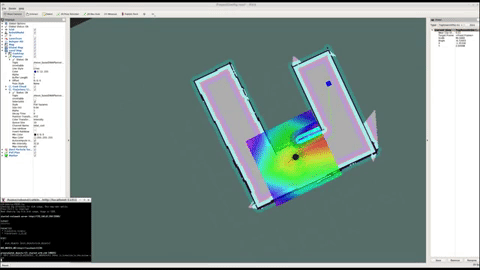

# Home Service Robot Project

<p align="center">
  
</p> 

The goal of this project is to program a robot than can autonomously map an environment and navigate to pick up and drop off virtual objects. List of the steps in this project :

* Design a simple environment with the Building Editor in Gazebo.
* Teleoperate your robot and manually test SLAM.
* Create a wall_follower node that autonomously drives your robot to map the environment.
* Use the ROS navigation stack and manually commands your robot using the 2D Nav Goal arrow in rviz to move to 2 different desired positions and orientations.
* Write a pick_objects node that commands your robot to move to the desired pickup and drop off zones.
* Write an add_markers node that subscribes to your robot odometry, keeps track of your robot pose, and publishes markers to rviz.

## Project setup 

Update system:
`sudo apt-get update`

Install the ROS navigation stack:
`sudo apt-get install ros-kinetic-navigation`

Create catkin workspace:
```sh
$ mkdir -p ~/catkin_ws/src
$ cd ~/catkin_ws/src
$ catkin_init_workspace
$ cd ~/catkin_ws
$ catkin_make
```
Clone the following repositories to catkin_ws/src:
```sh
$ cd ~/catkin_ws/src
$ git clone https://github.com/ros-perception/slam_gmapping.git
$ git clone https://github.com/turtlebot/turtlebot.git
$ git clone https://github.com/turtlebot/turtlebot_interactions.git
$ git clone https://github.com/turtlebot/turtlebot_simulator.git
```
Install package dependencies with `rosdep install [package-name]`

Copy content of this repository to catkin_ws/src

Catkin workspace should look something like this:
```
catkin_ws/src
    ├── slam_gmapping                  # gmapping_demo.launch file                   
    │   ├── gmapping
    │   ├── ...
    ├── turtlebot                      # keyboard_teleop.launch file
    │   ├── turtlebot_teleop
    │   ├── ...
    ├── turtlebot_interactions         # view_navigation.launch file      
    │   ├── turtlebot_rviz_launchers
    │   ├── ...
    ├── turtlebot_simulator            # turtlebot_world.launch file 
    │   ├── turtlebot_gazebo
    │   ├── ...
    ├── World                          # world files
    │   ├── ...
    ├── ShellScripts                   # shell scripts files
    │   ├── ...
    ├──RvizConfig                      # rviz configuration files
    │   ├── ...
    ├──wall_follower                   # wall_follower C++ node
    │   ├── src/wall_follower.cpp
    │   ├── ...
    ├──pick_objects                    # pick_objects C++ node
    │   ├── src/pick_objects.cpp
    │   ├── ...
    ├──add_markers                     # add_marker C++ node
    │   ├── src/add_markers.cpp
    │   ├── ...
    └──
```


Source and build the project:
```sh
$ cd ~/catkin_ws
$ source devel/setup.bash
$ catkin_make
```
Run `./home_service.sh` in `ShellScripts` directory to deploy the home service robot.
